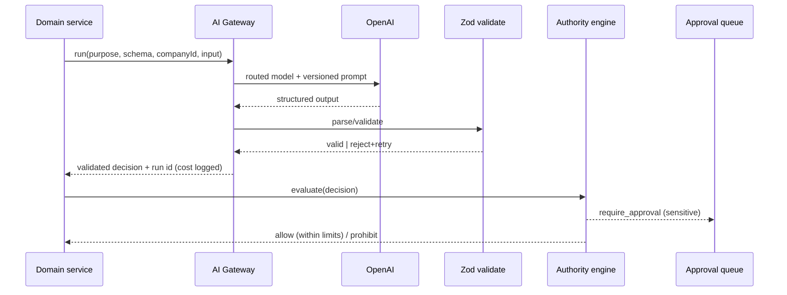

# AI_ORCHESTRATION.md

**Status:** Phase 0 deliverable — for review. Master spec §13, §19, §20.
Also serves as the **AI Gateway design** referenced by the build prompt. Implemented
Phase 3.

## 1. The gateway (single module — all AI routes through it)

Every AI call in the system goes through one module (`lib/ai/gateway`). Nothing else
imports the OpenAI SDK, and **no model IDs exist anywhere else** (fixing existing-bot
gap: Sasiri's `portal/lib/bot/ai.ts` holds model IDs inline). The gateway provides:

- **Structured, Zod-validated outputs.** Callers pass a Zod schema; the gateway
  requests structured output, parses, and **rejects + retries** on parse/validation
  failure. Free text never reaches business logic.
- **Prompt versioning.** Every prompt is a versioned, stored template
  (`prompt_versions`); the version used is recorded on each run.
- **Model routing.** Task/complexity/risk/language/latency/cost/tool-need drive model
  choice. See `MODEL_ROUTING.md`.
- **Cost & telemetry ledger.** Provider, model, prompt version, tokens, cost, latency,
  schema validity, retries, fallbacks, outcome → `ai_runs` / `model_usage`.
- **Retries & fallback.** Deterministic retry with backoff; fallback model on
  availability/schema failure; all recorded.
- **Full audit.** `ai_runs`, `ai_decisions`, `tool_calls` for material decisions.
- **Untrusted-content isolation.** External text is framed as data, never instructions.

## 2. Gateway call shape (conceptual)

```
aiGateway.run({
  companyId,                // isolation + attribution
  purpose,                  // routing key (e.g. 'receipt.extract', 'task.plan')
  schema,                   // Zod schema — REQUIRED
  promptVersion,            // resolved + logged
  input,                    // trusted context (single company only)
  untrusted,                // external content, isolated
}) -> { data: <parsed>, run: <ai_runs id>, cost, model }
```

Sensitive proposals returned by the gateway are **decisions**, not actions — they
flow to the authority engine (`AUTHORITY_MATRIX.md`) and, where required, the approval
queue. No gateway output executes a payment, accounting post, permission change,
employment action or surveillance action.

## 3. Reused patterns from the existing bot

The Sasiri bot already proves two patterns we lift into the gateway:
- **Strict structured output** (`buildSchema()` in `ai.ts`) → generalised to Zod.
- **Deterministic gates around the model** (`needsVerification`, `missingRequiredFields`
  computed in code, not by the model) → generalised into the authority engine and a
  configurable "verify high-risk outputs with a stronger model" policy.

## 4. Knowledge & SOPs (§20)

Versioned SOPs, policies, product/price info, authority rules, templates, FAQs,
playbooks with status + effective/review dates + traceable sources. **Draft, expired
or unapproved knowledge is never treated as current policy.** Approved static
instructions may be cached where the provider supports it.

## 5. Decision & audit records

`ai_runs` (one per call), `ai_decisions` (material decisions with the §13 structure),
`model_usage` (cost/token ledger), `tool_calls`, `prompt_versions`. Each material
decision is traceable end-to-end: input → prompt version → model → output → validation
→ authority decision → approval → execution outcome.

## 6. Gated AI capabilities (NOT in pilot)

Customer-facing AI agents, the Agent Builder, and controlled self-learning / quality
supervisor auto-actions are **out of pilot scope**. When built (Phase 13–14), agents
require: business scope, versioned instructions, approved knowledge, permitted
tools/data/actions, decision limits, prohibitions, handover rules, evaluation cases,
performance history, rollback — and the learning loop is detect → propose → review →
evaluate → approve → version → publish → monitor → rollback (never uncontrolled
self-training).

## 7. AI decision + approval diagram



## 8. Tests (Phase 3 gate)

Schema-invalid output rejected + retried; no model IDs outside gateway (lint/grep
test); cost ledger written; company attribution on every run; untrusted content never
alters control flow; fallback path recorded; a "sensitive" decision cannot execute
without the authority engine.
