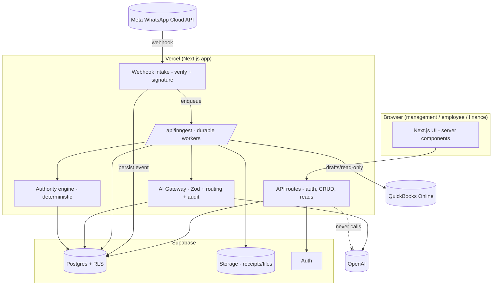
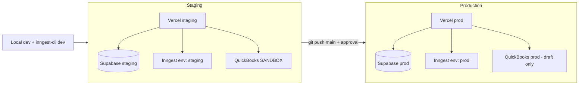

# ARCHITECTURE.md

**Status:** Phase 0 deliverable — for review. Master spec §2, §4.

## 1. Architectural principles

1. **Event-driven core.** Every authorised occurrence is persisted as an `events`
   row **before** any AI or business logic runs. Processing is idempotent, deduped,
   retryable, auditable. Failed events are never lost; duplicates never double-write.
2. **Modular monolith, not microservices.** One well-structured Next.js app on
   Vercel with clear internal module boundaries (spec §4: "avoid unnecessary
   microservices during the pilot"). Durable work runs as Inngest functions.
3. **The web tier never calls AI models directly.** All AI goes through the backend
   AI gateway → schema validation → deterministic rules → permission check → audit.
4. **Company isolation at every layer:** DB (RLS) + service + API + job + AI-context
   + file-storage.
5. **Deterministic authority around AI.** AI proposes structured decisions; code
   decides what is allowed; humans approve sensitive actions.
6. **Adapters for integrations, a gateway for models.** No model IDs and no vendor
   SDK calls scattered through business logic.

## 2. Component map

- **Web/UI (Next.js App Router, server components):** management/employee/finance
  dashboards. Server-side data fetch only; no direct OpenAI calls from the client.
- **API routes (`/app/api/*`):** request/response work — auth, CRUD behind
  permission checks, webhook intake (verify + signature), reads for dashboards.
- **Ingress adapters:** WhatsApp (Meta Cloud API), QuickBooks, Storage upload,
  (later) Gmail/Sheets/Calendar/GPS/CCTV. Each adapter: verify → normalise →
  **persist event** → enqueue.
- **Event store (Supabase Postgres):** `events`, `event_sources`, `event_links`,
  `processing_attempts`, `dead_letter_events`.
- **Durable workers (Inngest at `/api/inngest`):** event consumers, OCR/extraction,
  QuickBooks draft + reconciliation, scheduled sweeps, daily summary. Each has an
  explicit idempotency key.
- **Domain services (modules):** workforce, tasks, projects, approvals/authority,
  expenses/receipts, payments, finance, CRM. Pure TypeScript modules with their own
  data access and audit hooks.
- **AI gateway (single module):** OpenAI behind Zod-validated structured outputs,
  prompt versioning, model routing, token/cost/latency ledger, retries, fallback,
  full audit. See `AI_ORCHESTRATION.md` + `MODEL_ROUTING.md`.
- **Authority engine (deterministic):** the authority matrix as code (§13,
  `AUTHORITY_MATRIX.md`). Validates every AI-proposed and human-initiated sensitive
  action before it touches state.
- **Audit & observability:** immutable `audit_logs`, health signals, cost metrics.

## 3. Request/event flow (the golden path)

1. External occurrence hits an adapter (e.g. WhatsApp webhook).
2. Adapter verifies authenticity (HMAC signature / OAuth), **hard-rejects** on
   failure, normalises, computes a **dedup key**, and inserts one `events` row
   (`status='received'`). On unique-key conflict it is a duplicate → no-op.
3. Adapter returns a fast `200` to the sender, then enqueues an Inngest event
   referencing the `events.id`.
4. The Inngest consumer loads the event, runs domain logic **inside an idempotency
   guard** keyed on `events.id` (+ step). Any AI call goes through the gateway and
   returns a Zod-validated structure.
5. Sensitive proposals go to the **approval queue**; nothing sensitive executes
   without a human decision.
6. Every material step writes an audit row. Failures increment `attempts`; after N
   retries the event moves to `dead_letter_events` and raises a health alert.

## 4. Why Inngest (not Vercel Cron alone)

Vercel Cron can fire endpoints but gives no exactly-once execution, no durable
retry/backoff/dead-letter, and no jobs longer than the function timeout. The pilot
has all three needs (a doubled QuickBooks post costs real money; OCR and
reconciliation are long; AI chains are multi-step). Therefore **all money-touching,
long-running and scheduled work runs as Inngest functions**; simple request/response
work stays in API routes. See `DECISIONS.md` D-002.

## 5. System architecture diagram

## 6. Deployment topology

Staging and production use **separate Supabase projects** and separate Inngest
environments. QuickBooks is sandbox in staging. See `DEPLOYMENT_PLAN.md`.

## 7. Key boundaries

- UI ⟶ API ⟶ services ⟶ DB. UI never imports service-role clients or the AI gateway.
- Adapters ⟶ event store ⟶ Inngest ⟶ services. No adapter runs business logic inline.
- Services ⟶ authority engine ⟶ (approval queue | execute) ⟶ audit. No sensitive
  action skips the authority engine.
- AI gateway is the only place OpenAI is imported and the only place model IDs live.
