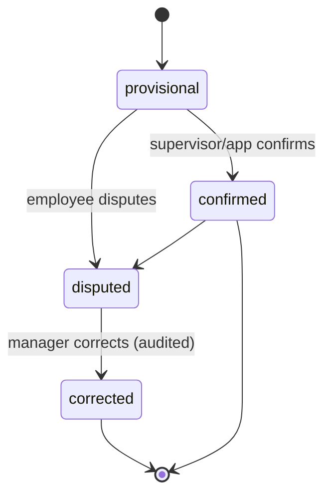

# ATTENDANCE_AND_SITE_MODEL.md

**Status:** Phase 0 deliverable — for review. Master spec §9, §17, §23.
**Pilot: attendance is manual/app only. All site/GPS/CCTV sourcing is GATED.**

## 1. Pilot attendance (built)

- Sources: app/manual check-in, assigned shift, supervisor confirmation.
- States: `provisional` → `confirmed` | `disputed` → `corrected`.
- Correction & dispute workflow is mandatory: an employee can dispute; a permitted
  manager corrects; every change is audited.
- No automatic discipline from any source.

## 2. Gated site/attendance evidence (NOT built in pilot)

Once (and only once) the privacy gate is cleared (approved monitoring policy,
notices/signage, purpose limitation, configurable retention, role-based viewing,
access/export logging, country-specific legal review), attendance MAY additionally
correlate: GPS/geofence arrival, assigned vehicle, access-control event, CCTV event.

Even then:
- These are **supporting evidence, not infallible truth**.
- GPS or CCTV alone must **never** automatically impose discipline.
- Correlation creates an **observation for human review**, not an accusation.

## 3. Gate checklist (blocks any of the above from staging)

- [ ] Documented monitoring purpose and policy
- [ ] Written notices + physical signage where applicable
- [ ] Company vehicle/device policy signed
- [ ] Configurable retention + deletion implemented
- [ ] Role-based viewing + access/export logging
- [ ] Correction/dispute workflow
- [ ] Country-specific legal + privacy review sign-off

## 4. Diagram (pilot attendance only)

## 5. Tests

Attendance transitions, dispute→correction audit trail, isolation. Gated GPS/CCTV
correlation tests are deferred with the feature.
