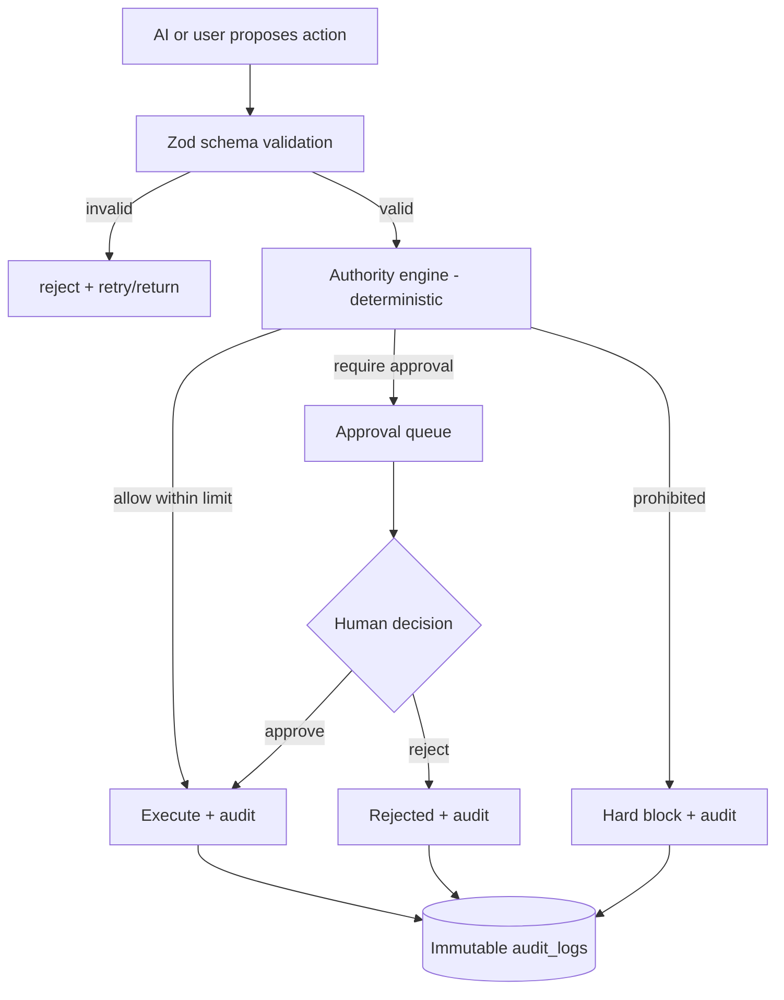

# AUTHORITY_MATRIX.md

> **⚠️ QUICKBOOKS SUPERSEDED (D-011 / NEXT_PHASE_DEVELOPER_BRIEF).** QuickBooks is
> **not used** and is **not** the accounting source of truth. The internally-owned
> double-entry Accounting Core (`src/accounting/*`) is the sole accounting source of
> truth. Ignore every QuickBooks connection / posting / draft / sync / OAuth /
> reconciliation instruction in this document; those references are historical only.
> See document precedence in `CLAUDE.md`.

**Status:** Phase 0 deliverable — for review. Master spec §13. Implemented Phase 6.
This is the **deterministic authority engine** spec. The matrix is **code, never an
AI decision.**

## 1. AI authority levels (§13)

1. **Advice only** — AI may surface information; no state change.
2. **Policy recommendation** — AI proposes; no execution.
3. **Policy approval without payment execution** — a human approves a recorded
   decision; no money moves.
4. **Approved workflow execution** — a pre-approved, deterministic workflow runs.
5. **Prohibited autonomous action** — never done by AI.

## 2. Prohibited without authorised human approval (§13)

The AI must **never** autonomously: make/transfer money; materially change
accounting; approve payroll/tax returns; issue significant refunds/discounts; enter
contracts; send final legal notices; hire/dismiss/discipline; change sensitive
permissions; expose confidential data; approve regulated decisions.

These are **hard-blocked in code**: even a valid, schema-correct AI proposal for one
of these can only ever create an **approval queue item**, never an execution.

## 3. Decision structure (validated — Zod)

Every material AI decision must carry: company + related IDs; decision type; facts;
evidence; policy sources; missing information; assumptions; contradictions;
recommendation; alternatives; confidence; risk; financial impact; required reviews;
approval requirement; proposed actions; prohibited actions; follow-up. The gateway
returns this as a Zod-validated object; a parse failure is rejected and retried, never
passed through.

## 4. Authority rules (deterministic)

`authority_rules` + `authority_limits` express, per company/role/action:
- whether the action is **allowed at all** (permission — see PERMISSION_MODEL);
- the **threshold** below which a permitted role may self-approve (e.g. expense ≤ X);
- above the threshold or for any §2 action → **required approver role(s)** and
  **approval queue**;
- special-review flags (e.g. uncertain tax → accountant review).

The engine is a pure function: `evaluate(action, context, proposal) → { decision:
allow | require_approval | prohibit, required_approvers, reasons }`. Unit-tested
exhaustively.

## 5. Approval flow

## 6. Approval queue & audit

- `approvals` rows: proposed action, proposer (user/AI + confidence), authority
  decision, required approvers, status, decider, decision, timestamps.
- Every terminal state writes an **immutable** `audit_logs` row (who, what,
  before/after, source, approver, AI confidence, policy source).
- Approvals are company-scoped and permission-checked; an approver cannot approve
  outside their authority.

## 7. Pilot authority thresholds (to confirm — OPEN_QUESTIONS)

Expense self-approve limit per role; finance-review threshold; who may verify tasks;
who may reactivate employees; QuickBooks draft approver. Values are configuration, not
code constants.

## 8. Tests (Phase 6 gate)

Every §2 action cannot execute autonomously (only queues); threshold boundaries
(just-below self-approves, just-above requires approval); required-approver
enforcement; schema-invalid proposals rejected; immutable audit written on every
path; company isolation on approvals.
