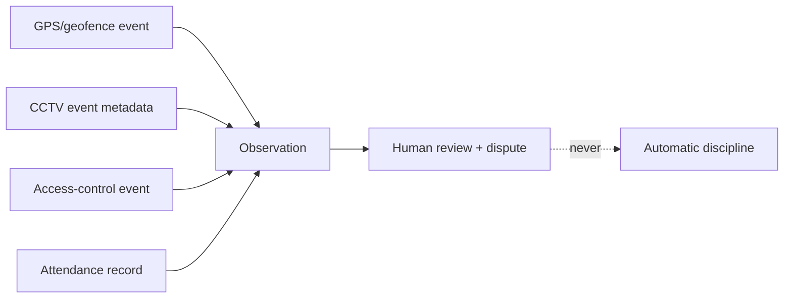

# CCTV_GPS_AND_FLEET_MODEL.md

**Status:** Phase 0 deliverable — for review. Master spec §17. **GATED — NOT BUILT IN
PILOT.** This document exists so the mature architecture is designed, per spec, and so
the gate is explicit. No tables, adapters or code are created until the gate clears.

## 1. Hard gate (spec §17, §23, §26)

Nothing in this document may be implemented — not even schema — until ALL of:

- documented purpose + monitoring policy;
- written notices + signage;
- company vehicle/device policy;
- data minimisation + configurable retention + deletion;
- role-based viewing + access/export logging + encryption + secure device credentials;
- correction/dispute + human review;
- **country-specific legal + privacy review sign-off.**

**Facial recognition is not implemented — now or later — without a separate legal,
privacy, security, bias and accuracy assessment.** It is out of scope entirely for
the pilot and the foreseeable roadmap.

## 2. Future design (reference only)

- **Adapters** for compatible IP cameras, NVR/VMS, CCTV event APIs, access control,
  GPS/telematics, equipment trackers, approved mobile location. Least-privilege
  credentials; provider behind an adapter; health/last-sync/errors tracked.
- **CCTV:** camera inventory/location, authorised live-view links, device/camera
  health, tamper/obstruction/motion/intrusion/person/vehicle/restricted-area/
  after-hours events, metadata, associated site/project/task/incident, selected
  clips, retention/deletion. **Do not stream all video to AI** — prefer local
  recording + event metadata + preserved relevant clips.
- **GPS/telematics:** vehicle/equipment/tracker + driver/operator assignments,
  authorised current location, trips/route/distance, geofence entry/exit,
  arrival/departure/dwell, after-hours/unauthorised movement, idling, speed,
  disconnection/tamper, maintenance km, operating hours, fuel.
- **Geofences:** versioned, for mines/workshops/branches/yards/auctions/customer/
  supplier sites/farms/restricted areas.
- **Site ops:** worker/vehicle arrival/departure, visitors, authorised hours,
  restricted zones, equipment movement, deliveries, incidents, device health.

## 3. Correlation principle

Correlating task/employee/attendance/site/vehicle/GPS/CCTV/payment/receipt/fuel
creates an **observation for human review, not an automatic accusation**. GPS/CCTV
are **supporting evidence, not infallible truth**. No automatic discipline.

## 4. Future correlation diagram (reference)

## 5. Status

**Deferred.** Revisit only after Phase 14+ and only with the gate cleared.
