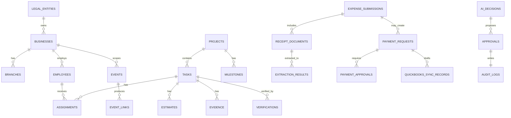

# DATA_MODEL.md

**Status:** Phase 0 deliverable — for review. Master spec §6, §7.
This documents the **pilot** schema (a practical subset of §7), designed so the
multi-company hierarchy is real from day one. Not every §7 table is created — only
those the pilot needs. Gated domains (GPS/CCTV/agents) are modelled but not built.

## 1. Universal conventions (every table)

- `id uuid primary key default gen_random_uuid()`
- `company_id uuid not null references businesses(id)` — the isolation key
- `created_at timestamptz not null default now()`, `updated_at timestamptz not null default now()`
- **RLS enabled** with a company-scoped policy (see `PERMISSION_MODEL.md`).
- Money as `numeric(18,2)` + `currency char(3)`; never floats.
- Enumerations enforced by `check` constraints or Postgres enums + mirrored in Zod.
- No hard deletes of records with history — soft-deactivate (`status`/`active`).

> **Isolation model note.** `company_id` references the operating `businesses` row.
> The org hierarchy (legal_entity → business → branch → department) is represented by
> the `org_*` tables; cross-company reporting is done through explicitly authorised
> views, never by relaxing RLS. See `SECURITY_AND_PRIVACY_MODEL.md`.

## 2. Organisation & users

- `legal_entities` (id, name, country, currency, tax_ids)
- `businesses` (id, legal_entity_id, name) — **`company_id` everywhere points here**
- `branches`, `departments`, `cost_centres`, `sites` (scoped to a business)
- `users` (Supabase `auth.users` mirror: id, email, display_name, status, mfa flags)
- `employees` (id, company_id, user_id?, name, status active/inactive, timezone,
  branch_id, department_id, manager_employee_id)
- `employment_records`, `business_assignments`, `reporting_lines`
- `roles` (company_id, key, name), `permissions`, `role_permissions`,
  `authority_limits` (role/employee → limit type → threshold; see AUTHORITY_MATRIX)
- `skills`, `employee_skills`, `responsibilities`

## 3. Workforce, schedule, attendance, capacity

- `working_schedules`, `shifts`, `holidays`, `leave`, `absence`, `availability`
- `capacity_reservations`, `attendance` (provisional/confirmed/disputed/corrected;
  manual/app check-in in pilot — **no GPS/CCTV source**). See `WORKFORCE_CAPACITY_MODEL.md`.

## 4. Communications & events

- `contacts`, `identifiers`, `channels`, `external_accounts`
- `conversations`, `messages`, `attachments`
- `events`, `event_sources`, `event_links`, `processing_attempts`,
  `dead_letter_events` — see `EVENT_SCHEMA.md`
- `scheduled_jobs`, `job_attempts` (Inngest run bookkeeping / sweeps)

## 5. Work & projects

- `tasks`, `subtasks`, `assignments`, `estimates`, `estimate_revisions`,
  `task_updates`, `time_entries`, `task_dependencies`, `evidence`, `verifications`,
  `checklists`, `blockers`, `escalations` — see `TASK_STATE_MODEL.md`
- `project_ideas`, `projects`, `phases`, `milestones`, `risks`, `budgets`,
  `project_documents`, `project_team_members`, `reviews`

## 6. Procurement, payments, finance (pilot subset)

- `expense_submissions`, `receipt_documents`, `extraction_results`,
  `missing_receipt_declarations` — see `PAYMENT_AND_RECEIPT_MODEL.md`
- `payment_requests`, `payment_allocations`, `payment_approvals`, `payment_events`
- `employee_advances`, `reimbursements`, `supplier_advances`, `refunds`
- `suppliers`, `purchase_requests`, `purchase_orders` (light in pilot)
- `quickbooks_connections`, `quickbooks_sync_records`, `bank_transaction_references`,
  `reconciliation_records` — see `QUICKBOOKS_INTEGRATION_MODEL.md`
- `financial_snapshots`, `payments_due`, `expected_receipts`, `financial_alerts`
  (read-only intelligence)

## 7. Governance & AI

- `meetings`, `actions`, `decisions`, `approvals`, `authority_rules`, `policies`,
  `sops`, `contracts`, `obligations`, `incidents`
- `ai_runs`, `ai_decisions`, `model_routes`, `model_usage`, `tool_calls`,
  `prompt_versions` — see `AI_ORCHESTRATION.md`
- `integrations`, `integration_health`, `system_health`, `notifications`,
  `security_events`, `audit_logs`, `feature_flags`

## 8. Gated (modelled, NOT built in pilot)

`assets`, `vehicles`, `gps_devices`, `gps_events`, `geofences`, `cameras`,
`camera_events`, `video_clips`, `access_events`, `site_visits`, `site_incidents`,
`ai_agents`, `agent_roles`, `evaluations`. Documented in `CCTV_GPS_AND_FLEET_MODEL.md`
for future reference only. No migrations created until the privacy gate is cleared.

## 9. High-level ER diagram (pilot core)

## 10. Retention & deletion

- Audit/financial records: retained, immutable/tamper-evident, never hard-deleted.
- Events + raw payloads: retained per policy; PII minimised; configurable retention.
- Employees with history: deactivated, never deleted (§8 spec).
- Gated media (video/GPS): retention rules are a **gate prerequisite**, not a default.
