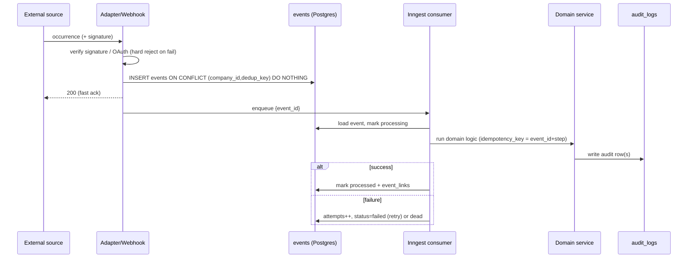

# EVENT_SCHEMA.md

> **⚠️ QUICKBOOKS SUPERSEDED (D-011 / NEXT_PHASE_DEVELOPER_BRIEF).** QuickBooks is
> **not used** and is **not** the accounting source of truth. The internally-owned
> double-entry Accounting Core (`src/accounting/*`) is the sole accounting source of
> truth. Ignore every QuickBooks connection / posting / draft / sync / OAuth /
> reconciliation instruction in this document; those references are historical only.
> See document precedence in `CLAUDE.md`.

**Status:** Phase 0 deliverable — for review. Master spec §2, §4(5). Implemented in
Phase 2.

## 1. Principles

- Persist the raw event **before** any AI or business logic.
- Every event: internal ID + external source ID, source time + receipt time, company
  scope, dedup key, validation status, attempt count, error, traceable evidence.
- Processing is **idempotent, retryable, auditable**. A failed process never loses
  the original event. A duplicate never creates a duplicate downstream record.

## 2. Tables

### `events`
| column | type | notes |
|---|---|---|
| id | uuid pk | internal id |
| company_id | uuid not null | FK; scope. Set at ingest from the adapter's routing |
| source | text not null | `whatsapp` \| `quickbooks` \| `storage_upload` \| `app` \| `email` \| `gps` \| `cctv` … |
| source_event_id | text | external id (e.g. WhatsApp `wa_message_id`) |
| dedup_key | text not null | see §3; unique with company_id |
| event_type | text not null | `message.inbound`, `receipt.uploaded`, `qbo.change` … |
| payload | jsonb not null | raw normalised payload (untrusted content) |
| source_time | timestamptz | when it happened at source |
| received_at | timestamptz not null default now() | when we received it |
| status | text not null default `received` | `received`→`processing`→`processed`\|`failed`\|`dead` |
| attempts | int not null default 0 | |
| last_error | text | |
| processed_at | timestamptz | |
| created_at / updated_at | timestamptz | |

Indexes: **unique `(company_id, dedup_key)`** (the dedup guarantee);
`(status) where status in ('received','failed')`; `(company_id, event_type, received_at desc)`.

### `event_sources`
Registered ingress channels with credentials-by-reference, health, last sync, webhook
secret reference. One row per connected WhatsApp number / QBO connection / etc.

### `event_links`
Join from an event to the business records it produced/affected
(`event_id`, `entity_type`, `entity_id`) — the evidence/traceability trail.

### `processing_attempts`
One row per consumer attempt (`event_id`, `attempt_no`, `started_at`, `finished_at`,
`outcome`, `error`, `idempotency_key`). Feeds observability + dead-letter policy.

### `dead_letter_events`
Events that exhausted retries (`event_id`, `reason`, `payload_snapshot`, `created_at`,
`resolved_at`, `resolved_by`). Replayable by an authorised human; replay is audited.

## 3. Dedup key

Deterministic, per source:
- WhatsApp message → `wa:{phone_number_id}:{wa_message_id}`.
- WhatsApp status → `wa-status:{wa_message_id}:{status}`.
- QuickBooks change → `qbo:{realmId}:{entity}:{id}:{syncToken}`.
- Storage upload → `upload:{bucket}:{objectPath}:{etag}`.
- App action → `app:{actor}:{action}:{client_generated_uuid}`.

The **unique `(company_id, dedup_key)`** constraint means an `INSERT … ON CONFLICT DO
NOTHING` makes re-delivery a no-op. This is the single source of the "no duplicate
downstream record" guarantee, reinforced by per-consumer idempotency keys (§4).

## 4. Idempotent processing

- Ingest = **persist-then-enqueue**: insert `events` row, then send an Inngest event
  carrying `events.id`. If enqueue fails, a sweep re-enqueues `status='received'` rows.
- Each Inngest consumer derives its **idempotency key** from `events.id` (+ step
  name) so re-execution of a retried step does not double-write. Downstream writes
  (task create, receipt create, QBO draft, payment record) also carry a natural
  unique key so a duplicate is rejected at the DB even if two consumers race.
- State transitions: `received → processing → processed | failed`. `failed` retries
  with backoff up to N; then `→ dead` + `dead_letter_events` + health alert.

## 5. Pipeline diagram

## 6. Tests (Phase 2 gate)

- Insert same webhook payload twice → exactly one `events` row, one task/record.
- Enqueue-then-crash before processing → sweep re-enqueues; still one downstream row.
- Retried consumer step → no duplicate write (idempotency key + DB unique).
- Exhausted retries → row in `dead_letter_events` + alert; original payload intact.
- Cross-company: an event for company A never yields a record visible to company B.
