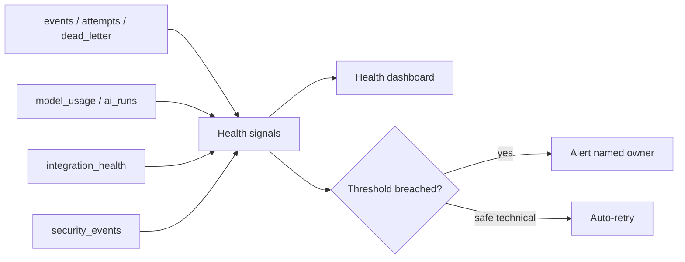

# OBSERVABILITY.md

**Status:** Phase 0 deliverable — for review. Master spec §22, §24.

## 1. What we monitor (§24)

Application / database / storage; Inngest jobs & queues; webhooks / events / retries;
WhatsApp / QuickBooks (+ later Google) connectivity; model latency / availability /
cost / schema errors / fallback / low confidence; sync age / stale business data;
backups; unauthorised access; retention failures. (GPS/camera/device health is gated.)

## 2. Signals & tables

- `system_health` — component up/down, last check, latency.
- `integration_health` — per-adapter last sync, error counts, token expiry.
- `events` + `processing_attempts` + `dead_letter_events` — pipeline backlog,
  retry rates, dead-letter count.
- `model_usage` / `ai_runs` — AI latency, cost, schema-failure and fallback rates,
  low-confidence rate.
- `security_events` — auth failures, permission denials, suspicious access.
- `notifications` — alert delivery (reuse existing web-push know-how from Sasiri).

## 3. Alerting

- **Auto-retry** safe technical failures (built into Inngest + event retries).
- **Alert a named owner** on: repeated failure / dead-letter growth, stale business
  data, security suspicion, integration disconnection, AI cost spike or schema-error
  spike, queue backlog. Every alert type has an owner (see `DEPLOYMENT_PLAN.md`).

## 4. Dashboards (§22)

- **Management:** critical matters, approvals, overdue/near-due/blocked work, capacity
  & absence, project risks, cash/receipts/payments (read-only), unmatched/undocumented
  payments, integration/AI problems, cost, changes since yesterday.
- **Employee:** authorised priorities, tasks, estimates, context, evidence, time/
  progress/blockers, help, SOPs, notifications, approvals, leave, personal capacity.
- **Finance:** submissions, unreadable/missing/duplicate items, approvals, QuickBooks
  readiness/failures, unmatched bank transactions, missing receipts, reimbursements/
  advances, spend analysis.
- **Health:** components, jobs, webhooks, integrations, AI cost/quality, incidents.

Natural-language answers link back to underlying records and evidence. All dashboard
data is fetched **server-side**; the client never calls OpenAI.

## 5. Health diagram

## 6. Tests

Dead-letter growth raises an alert; stale-sync detection; cost-spike alert; permission
-denial captured in `security_events`; health endpoint reflects a downed integration.
