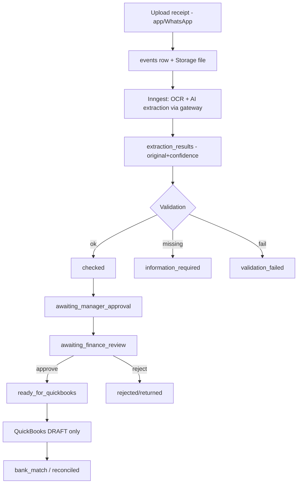

# PAYMENT_AND_RECEIPT_MODEL.md

> **⚠️ QUICKBOOKS SUPERSEDED (D-011 / NEXT_PHASE_DEVELOPER_BRIEF).** QuickBooks is
> **not used** and is **not** the accounting source of truth. The internally-owned
> double-entry Accounting Core (`src/accounting/*`) is the sole accounting source of
> truth. Ignore every QuickBooks connection / posting / draft / sync / OAuth /
> reconciliation instruction in this document; those references are historical only.
> See document precedence in `CLAUDE.md`.

**Status:** Phase 0 deliverable — for review. Master spec §14, §15. Implemented Phase 9.

## 1. Capture (§14)

Authorised submission via app, WhatsApp, authorised email (later), using receipt
photos, invoices, PDFs, screenshots, descriptions, voice notes, and
**missing-receipt declarations**. Original source files + metadata are preserved in
Supabase Storage; the DB references them. Files are never overwritten.

## 2. Receipt states

`draft`, `submitted`, `extraction_in_progress`, `extracted`, `information_required`,
`validation_failed`, `checked`, `awaiting_manager_approval`, `awaiting_finance_review`,
`approved`, `rejected`, `returned`, `ready_for_quickbooks`, `upload_in_progress`,
`uploaded`, `upload_failed`, `bank_match_pending`, `matched`, `reconciled`, `reversed`,
`archived`.

## 3. Extraction (via AI gateway, as an Inngest job)

Extract: business, branch, department, site, project, task, vehicle/asset, employee,
supplier, tax ID, invoice/receipt number, dates, amounts, tax, currency, payment
method, category, purpose, order/work references. Store **original extraction +
corrected values + editor + confidence** (`extraction_results`). **Never invent
missing facts** — unknown fields stay empty and route to `information_required`.

Validation checks: readability, arithmetic (totals/tax), duplicates, supplier,
authorisation, budget, project, work/order match, bank/card match, unusual patterns,
tax confidence. Failures → `validation_failed` or `information_required` (never a
silent guess).

## 4. Missing-receipt declarations

Record amount, date, payee, purpose, project/task, payment method, reason, approvals.
**Clearly labelled** as a declaration. **Never fabricate a receipt.**

## 5. Payment intelligence — source & use of funds (§15)

Every payment/expense/advance/reimbursement/receipt/bill/refund/bank transaction
links to: legal entity, business, branch, department, site, project, customer,
supplier/payee, requester, payer, approver, task, order/work order, vehicle/asset,
category, budget, funding source, evidence, QuickBooks record, bank/card record.

Payment states: `proposed`, `requested`, `information_required`, `awaiting_approval`,
`approved`, `rejected`, `scheduled`, `payment_made`, `receipt_pending`,
`evidence_received`, `ready_for_quickbooks`, `uploaded`, `bank_match_pending`,
`bank_matched`, `reconciled`, `disputed`, `refunded`, `reversed`, `closed`.

`payment_allocations` support **split** allocation across projects/departments/sites/
vehicles/assets/categories while preserving history.

## 6. Exceptions (evidence-backed, human-reviewed)

Compare requested/approved/paid/receipt/QuickBooks/bank/tax/allocation/refund amounts.
Flag missing evidence/approvals, duplicates, excessive/split payments, changed
supplier accounts, unusual timing, currency/entity mismatch, unmatched bank activity,
incomplete recording. **Never auto-conclude fraud** — raise an exception for review.

## 7. Duplicate & double-pay prevention

- Receipt duplicate detection: hash of file + (supplier, invoice_number, amount, date)
  fingerprint; a match routes to review, never silent-drops.
- Reimbursement guard: a receipt/advance can be reimbursed **once**; `reimbursements`
  enforce a unique settlement per submission.
- QuickBooks draft idempotency: see `QUICKBOOKS_INTEGRATION_MODEL.md`.
- All of the above ride on the event dedup key + consumer idempotency (EVENT_SCHEMA).

## 8. Human-in-the-loop boundary

Approval to **record** an expense is **not** permission to **pay** it. The AI never
executes a bank payment. Money movement is out of pilot scope entirely; the pilot
tracks *purpose and records*, prepares QuickBooks **drafts**, and reconciles.

## 9. Flow diagram

## 10. Tests (Phase 9 gate)

OCR-correction preservation, unreadable/missing/duplicate documents, totals/tax
arithmetic, reimbursement/advance settlement (no double pay), split allocations,
exception generation, idempotent extraction (replay = one result), company isolation,
audit on approvals.
