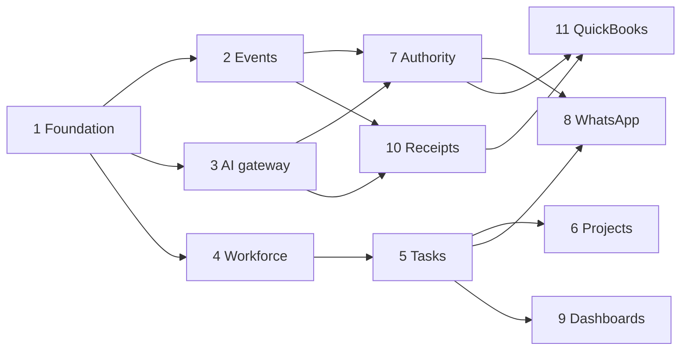

# PHASED_IMPLEMENTATION_PLAN.md

> **⚠️ QUICKBOOKS SUPERSEDED (D-011 / NEXT_PHASE_DEVELOPER_BRIEF).** QuickBooks is
> **not used** and is **not** the accounting source of truth. The internally-owned
> double-entry Accounting Core (`src/accounting/*`) is the sole accounting source of
> truth. Ignore every QuickBooks connection / posting / draft / sync / OAuth /
> reconciliation instruction in this document; those references are historical only.
> See document precedence in `CLAUDE.md`.

**Status:** Phase 0 deliverable — for review. Master spec §29 + build-prompt §3.
One phase at a time. After each: run tests, print `=== PHASE N COMPLETE ===`,
summarise, and **wait for approval**.

## Phase order (pilot)

| Phase | Name | Key deliverables | Gate tests |
|---|---|---|---|
| 0 | Assessment & architecture | This `docs/` set + diagrams. **No feature code.** | Docs reviewed & approved |
| 1 | Foundation | Next.js + TS + Supabase; multi-company schema (`company_id` everywhere); RLS on every table; Auth + roles; seed script; `.env.example` | PERMISSION §6 |
| 2 | Event pipeline | `events` + dead-letter; persist-then-enqueue; Inngest consumers w/ idempotency keys; replay-safe | EVENT_SCHEMA §6 |
| 3 | AI gateway | Single module; Zod outputs; prompt versioning; cost ledger; routing; no model IDs elsewhere | AI_ORCHESTRATION §8 |
| 4 | Workforce | Employees, roles, capacity, attendance (manual) | WORKFORCE §6 |
| 5 | Tasks | Full state machine; assignment; estimates+revisions; evidence; verification | TASK_STATE §8 |
| 6 | Projects | Projects, milestones, task linkage | project isolation + linkage |
| 7 | Approvals & authority | Authority matrix as code; AI→queue→human→audit | AUTHORITY §8 |
| 8 | WhatsApp (Meta Cloud API) | Webhook verify + signature (hard-reject); persist-then-enqueue; inbound routing; templates; 24h window | webhook contract + idempotency |
| 9 | Dashboards | Management/employee/finance; server-side data only | permission + isolation |
| 10 | Expenses & receipts | Upload→Storage; OCR (Inngest); AI extraction; verification; duplicate detection | PAYMENT §10 |
| 11 | QuickBooks | OAuth; **draft/read-only**; sync tokens; reconciliation job | QUICKBOOKS §8 |

> Note: the build prompt lists WhatsApp as step 8 and Approvals as step 7; the master
> spec §29 lists WhatsApp as phase 7. Both agree Approvals/Authority precede or sit
> beside WhatsApp. This plan keeps **Authority (7) before WhatsApp (8)** so
> WhatsApp-driven actions already have the authority engine to route through. See
> DECISIONS D-005.

## Cross-cutting, every phase

Company isolation, audit, idempotency, error handling, tests, docs update — never
deferred. The four non-negotiable suites (isolation, idempotency, authority, AI-schema)
must stay green.

## Explicitly NOT built in pilot (gated)

Phases 12–19 of the spec: CRM/customer AI agents, Agent Builder, GPS, CCTV, finance
consolidation across entities, multi-country. GPS/CCTV require the privacy gate;
agents require controlled-learning governance. Do not build ahead.

## Dependencies

## Rough sequencing

Phases 1–3 are the platform spine and should land first and solidly (isolation +
events + gateway). 4–6 build the operational domain. 7–8 add control + the WhatsApp
channel. 9 gives visibility. 10–11 add the money-adjacent (record/draft only) work.
Each phase is independently reviewable and reversible via feature flags.
