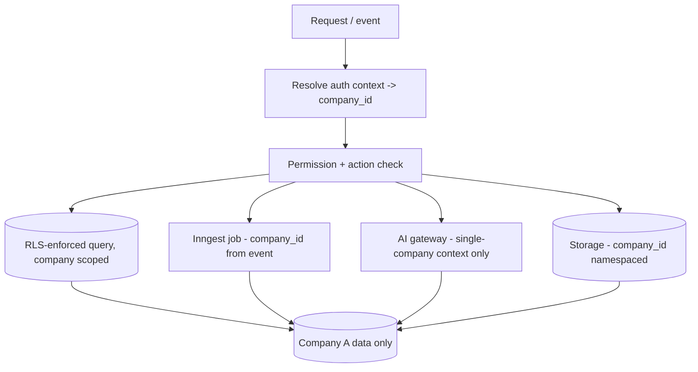

# SECURITY_AND_PRIVACY_MODEL.md

**Status:** Phase 0 deliverable — for review. Master spec §6, §23. Cross-cutting.

## 1. Company isolation (critical boundary)

Isolation is enforced at **every** layer; a breach at any one is a critical failure:

- **Database:** RLS enabled on every table; company-scoped policies. See
  `PERMISSION_MODEL.md`.
- **Service:** every query is scoped by the caller's `company_id`; service functions
  take an explicit auth context, never a raw client.
- **API:** every route resolves the caller → company → permission before data access.
- **Background jobs (Inngest):** each job carries the `company_id` from its event and
  scopes all reads/writes; the service-role client is used only inside jobs that set
  `company_id` explicitly (never in request handlers as an isolation shortcut).
- **AI context:** prompts are built from a single company's data only; no cross-company
  facts enter a prompt. The gateway records which company a run belongs to.
- **File storage:** Supabase Storage paths are namespaced by `company_id` with bucket
  policies; signed URLs are scoped and time-limited.

**Isolation tests are mandatory** and must fail loudly: for every read/write path,
prove company A cannot see or affect company B (DB, service, API, job, AI-context,
storage). Consolidated/cross-company reporting is done only through explicitly
authorised views — never by relaxing RLS.

## 2. Isolation diagram

## 3. AuthN / AuthZ

- Supabase Auth; secure sessions; **MFA for sensitive roles** (finance, admin).
- RBAC + **action** permissions (view/create/edit/approve/post/export/delete/
  administer/access-sensitive-media), least privilege. See `PERMISSION_MODEL.md`.
- Authority limits (thresholds) are deterministic code. See `AUTHORITY_MATRIX.md`.

## 4. Secrets

- Secrets only in env vars / Supabase secret storage; never in client bundles, never
  committed. `.env` is git-ignored; `.env.example` documents every variable.
- Service-role key is server-only (`server-only` import guard), used only in jobs
  that set company scope explicitly.
- No hardcoded project URLs/keys (fixing existing-bot risk R-4).

## 5. Webhook & integration security

- Verify every webhook signature **before** processing; **hard-reject** on mismatch
  (fixing existing-bot risk R-3, where a mismatch only warned and still processed).
- Replay protection via event dedup key + idempotent processing (EVENT_SCHEMA).
- Rate limiting on public endpoints; adapter credentials least-privilege.

## 6. Prompt injection & untrusted content

Instructions inside messages, emails, receipts, images, web pages, CCTV metadata and
external systems are **untrusted data** and can never override system rules. The AI
gateway isolates untrusted content, and **no free-text AI output triggers a sensitive
action** — it must pass Zod schema → deterministic authority rules → permission check
→ audit. File uploads are validated (type/size) and treated as untrusted.

## 7. Audit (immutable / tamper-evident)

Every sensitive action records: actor, action type, company, before/after, source,
reason, evidence, AI recommendation/confidence/policy, approver, time, execution
result, errors. Audit rows are append-only.

## 8. Privacy & retention

- Data minimisation; configurable retention; PII handled per policy; deletion honoured
  (`/data-deletion` style flows where user-facing).
- **GPS/CCTV/attendance monitoring is gated** behind approved notices, monitoring
  policy, purpose, retention, access controls, dispute process and country-specific
  legal review (see `ATTENDANCE_AND_SITE_MODEL.md`, `CCTV_GPS_AND_FLEET_MODEL.md`).
- No facial recognition without separate legal/privacy/bias/accuracy review.

## 9. Incident response & backups

Access logging, security-event capture, backup + verified restoration, documented
incident response. Health monitoring for unauthorised access and retention failures
(see `OBSERVABILITY.md`).
