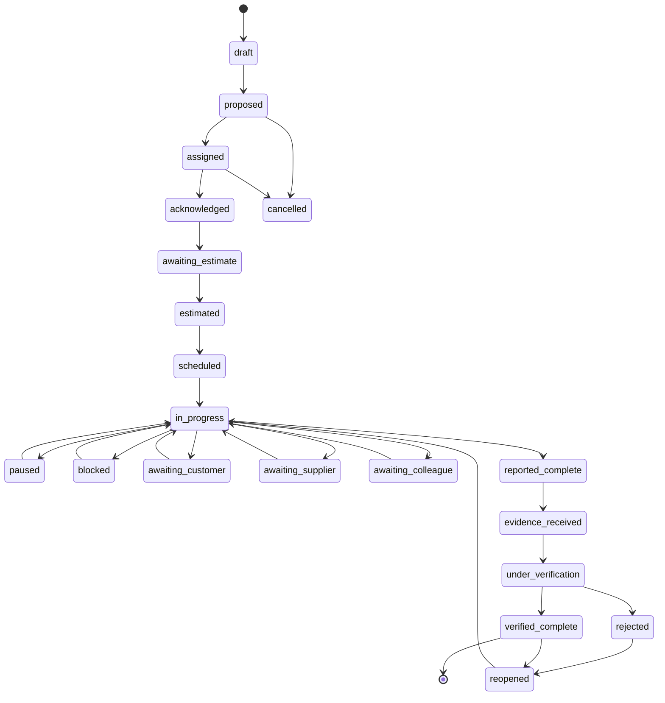

# TASK_STATE_MODEL.md

**Status:** Phase 0 deliverable — for review. Master spec §10, §11. Implemented Phase 4.

## 1. States (validated state machine)

`draft`, `proposed`, `assigned`, `acknowledged`, `awaiting_estimate`, `estimated`,
`scheduled`, `in_progress`, `paused`, `blocked`, `awaiting_customer`,
`awaiting_supplier`, `awaiting_colleague`, `awaiting_approval`, `reported_complete`,
`evidence_received`, `under_verification`, `verified_complete`, `rejected`,
`reopened`, `cancelled`.

**Core rule:** "Done" ≠ verified. `reported_complete` → `evidence_received` →
`under_verification` → `verified_complete` are distinct. Only a permitted verifier
(not the assignee, not the AI) can reach `verified_complete`.

## 2. Allowed transitions (enforced in code, not by AI)

Any transition not on this graph is rejected by the task service and logged. The
transition function is pure and unit-tested; the AI may only *propose* a transition
via a structured decision that the service validates.

## 3. Task fields (spec §10)

Business scope (`company_id`, branch/department); links to project/customer/supplier/
asset; type, objective, priority, risk; assigned staff + required skills; evidence
requirement; `ai_estimate`, `employee_estimate`, `approved_estimate`; planned vs
actual times; active/blocked/waiting time (elapsed calendar time is **not** active
work); dependencies; reminders; escalation; approval requirement.

## 4. Estimates & revisions

- Preserve the **original** estimate and **every** revision with a reason
  (`estimates`, `estimate_revisions`). Never overwrite.
- Three tracked values: AI estimate, employee estimate, approved estimate.

## 5. Time & progress

- `time_entries` distinguish active / blocked / waiting time.
- Employees may accept, estimate, start, pause, resume, report time/progress,
  raise blockers, request help/time, upload evidence — via app **or authorised
  WhatsApp** (Phase 7). WhatsApp updates arrive as events and drive transitions
  through the same validated service.

## 6. Delay attribution (§11)

Distinguish employee delay from customer/supplier/colleague/management/workload/
instruction/equipment/technical delay. The AI must never dismiss, discipline or
financially penalise staff — it can only surface and attribute, with evidence and a
correction path.

## 7. Verification & evidence

- `evidence` rows (files in Supabase Storage, links, notes) attach to a task.
- `verifications` record verifier, decision, notes, timestamp.
- Reaching `verified_complete` requires a permitted verifier role (see
  `AUTHORITY_MATRIX.md`) and writes an audit row.

## 8. Tests (Phase 4 gate)

State-transition matrix (legal vs illegal), estimate-revision preservation,
active-vs-elapsed time, blocked/waiting accounting, reassignment, WhatsApp-driven
transitions via events (idempotent), company isolation on every task read/write.
