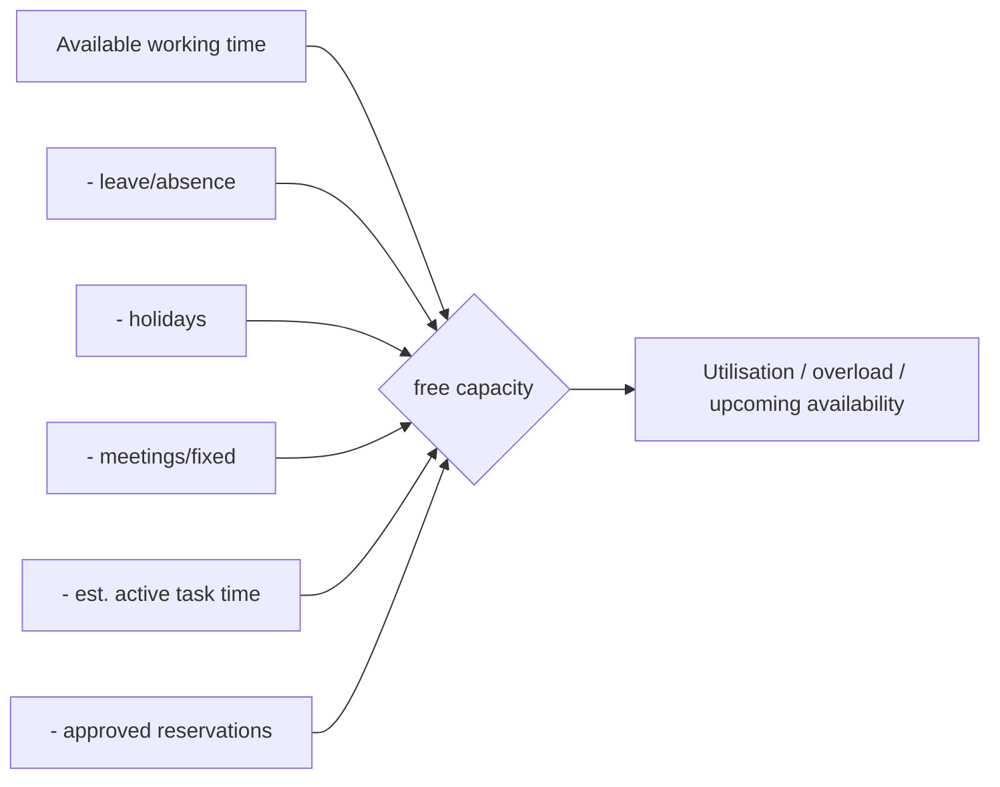

# WORKFORCE_CAPACITY_MODEL.md

**Status:** Phase 0 deliverable — for review. Master spec §8, §9. Implemented Phase 3.

## 1. Workforce management

Management can add, edit, activate, deactivate and **reactivate** employees; assign
company/branch/department/manager/role/skills/responsibilities/schedule/shift/
location/timezone/authority limits; record leave, absence, holidays, meetings,
training, availability; transfer open work; and revoke access.

**Never hard-delete an employee with historical records.** Deactivate, revoke access,
preserve history. Every change is audited (`audit_logs`).

Key tables: `employees`, `employment_records`, `business_assignments`,
`reporting_lines`, `roles`, `authority_limits`, `skills`, `employee_skills`,
`responsibilities`.

## 2. Schedules, leave, attendance

- `working_schedules`, `shifts`, `holidays`, `leave`, `absence`, `availability`.
- `attendance` states: `provisional`, `confirmed`, `disputed`, `corrected`.
- **Pilot attendance sources:** app/manual check-in, assigned shift, supervisor
  confirmation. **No GPS/CCTV** attendance in pilot (gated — see
  `ATTENDANCE_AND_SITE_MODEL.md`). GPS/CCTV alone must never impose discipline even
  after the gate opens.

## 3. Capacity formula (§9)

```
free_capacity =
    available_working_time
  − leave_and_absence
  − holidays
  − meetings_and_fixed_commitments
  − estimated_active_task_time
  − approved_capacity_reservations
```

Elapsed calendar time is **not** active work. `estimated_active_task_time` comes from
approved task estimates (see `TASK_STATE_MODEL.md`), counting active time only.

## 4. Capacity views & metrics

Daily / weekly / monthly / current / future capacity by employee, manager,
department, branch, business, project, role, skill. Metrics: available, planned,
actual, blocked, waiting, meeting/leave, free hours, utilisation, overload, upcoming
availability. **Thresholds are configurable** (`feature_flags`/settings), not hard-coded.

## 5. Diagram



## 6. Tests (Phase 3 gate)

Capacity math (each subtraction), leave/holiday effects, timezone correctness,
provisional→confirmed→disputed→corrected attendance transitions, reactivation
preserves history, company isolation, audit on every change.
